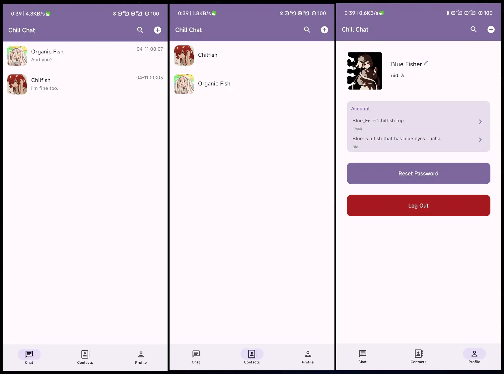
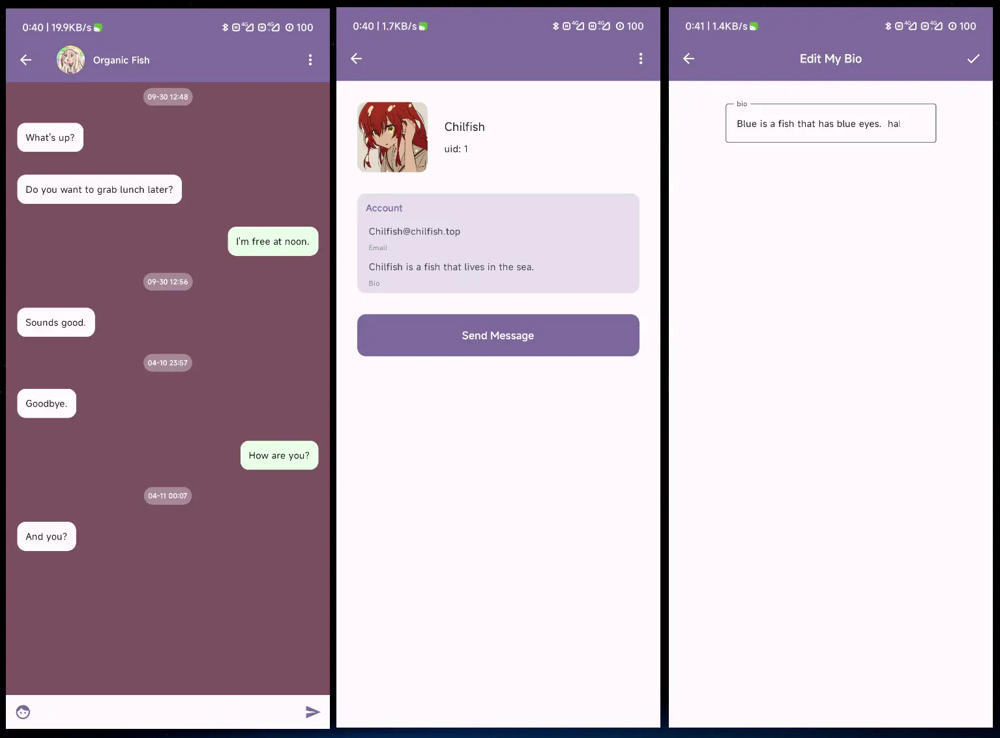

a simple online chat app client built with Jetpack Compose.

<!--
the simple server is [here](https://github.com/Chilfish/Chill-Chat-Server)
-->

> Just a demo for Compose learning & my homework.

### Tech. stack

- Kotlin & Coroutines
- Jetpack Compose modern toolkit for building native UI
- Jetpack Navigation for Routing
- Jetpack Room for offline store
- Material 3 Design
- Hilt for dependency injection
- Coil for image loading
- MVI architecture
- handling the HTTP via [com.drake.net](https://github.com/liangjingkanji/Net)
- chatting using the Socket.io

### Preview

 

**Main Page**

**Other Page**

**Login & Debug**

